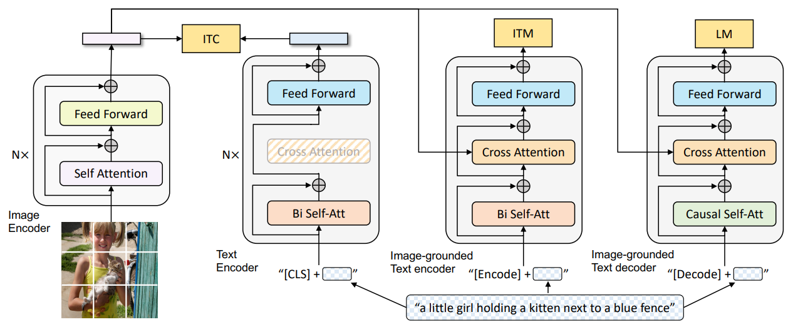

# BLIP1-HF-Captioning

**Modular BLIP-1 Fine-Tuning Framework with LoRA (Lightweight Adapter Injection)** using Hugging Face Transformers.

## 1. Project Description

This project reimplements the **BLIP-1 fine-tuning pipeline from scratch**, offering full control over data loading, model patching, and training — **without relying on the original [LAVIS](https://github.com/salesforce/LAVIS) framework** or any high-level wrappers such as `peft`.

We directly build on the Hugging Face Transformers implementation of `blip-image-captioning-large`, and manually inject **LoRA adapters** into the vision backbone (ViT-based) for parameter-efficient fine-tuning.

> ⚠️ Unlike typical LoRA implementations using the [`peft`](https://github.com/huggingface/peft) library, we encountered parameter incompatibility issues.  
> Instead, we implement LoRA manually using `torch.nn.Parameter` and `torch.nn.functional.linear`, and inject the low-rank adaptation weights into selected `Linear` layers via **PyTorch forward hooks**. This gives us complete control and compatibility with BLIP-1's internal transformer design.

<div align="center">
  
  <br />
  <em>Figure: BLIP-1 model architecture </em>
</div>

### Key Highlights

- **Full Code Ownership**: Everything — from dataset loading to loss calculation and training logic — is built manually for maximal flexibility.
- **LoRA Injection without PEFT**: Automatically patches 96 `nn.Linear` layers in the visual encoder via forward hooks.  
  LoRA parameters (`r`, `alpha`, `dropout`) are fully customizable and saved independently.
- **Modern Training Tricks**: Built-in support for cosine learning rate decay, linear warm-up, FP16 mixed precision, and gradient accumulation.
- **Prompt-Driven Captioning**: Supports free-form prompts and generates structured captions like *"A red block on a green block"*.

Whether you're a researcher exploring multimodal adaptation, or an engineer deploying captioning systems in robotics and smart manufacturing — this framework enables **modular, transparent and efficient fine-tuning** of BLIP-1.


## 2. LoRA Implementation Details

Instead of relying on external packages like `peft`, we manually implement **LoRA injection** in the vision backbone of BLIP-1 (ViT-based encoder). The process involves:

- Dynamically locating all `nn.Linear` layers inside the visual encoder (`vision_model`).
- Wrapping each Linear layer with LoRA adapters:  
  Each adapter is composed of two trainable matrices: **A (down-projection)** and **B (up-projection)**, injected into the forward pass.
- Applying **forward hooks** to add the LoRA term during inference and training:
  
$$
\text{Output} = W x + \alpha \cdot BAx
$$

Where:
- `r`: Rank of the adapter bottleneck
- `alpha`: Scaling factor for the LoRA update
- `dropout`: Optional dropout between A and B

```python
# simplified version
def apply_lora_to_linear(layer, r=8, alpha=16):
    A = nn.Parameter(torch.randn((r, in_features)))
    B = nn.Parameter(torch.randn((out_features, r)))
    ...
    def hook_fn(input, output):
        return output + (B @ (A @ input.T)).T * scale
    layer.register_forward_hook(hook_fn)
````

* This approach enables **adapter-style fine-tuning**, requiring only \~3M trainable parameters (vs. 300M+ in full fine-tuning).
* The adapter weights are saved separately and can be loaded into a frozen BLIP-1 model for downstream inference.

> See `model_patch.py` for full implementation.


